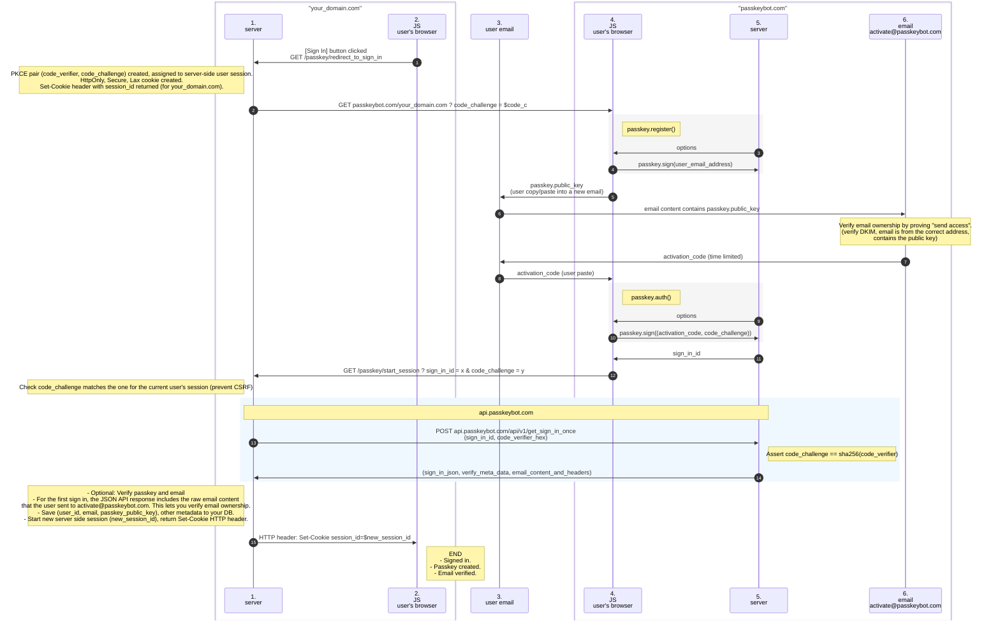
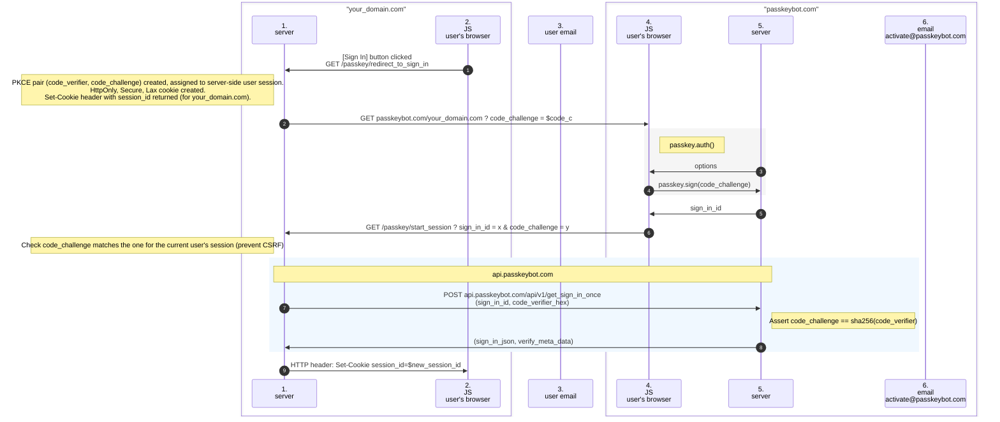

# 🔑 Passkeybot

[passkeybot.com](https://passkeybot.com)

Add passkey auth to your app or site with a few server side HTTP handlers.

⚠️ Currently Passkeybot in beta, please only use for non-sensitive use cases for now, and please provide feedback. [Get notified when Passkeybot becomes GA](https://forms.gle/oD9gHC5XodfYYdap6) ⚠️

Passkeybot is a hosted sign in page, requiring you to redirect your sign in button to https://passkeybot.com/your_domain.com.

With Passkeybot your user can create a passkey, verify their email and sign in.

The passkeys are stored under your domain (Requesting Party), so you can move away from Passkeybot at any time without having to have your users recreate their passkeys. This preserves the phishing resistant design of passkeys.

- The [demo](https://demo.enzom.dev) app will show you a live walk through.
- The [sequence diagrams](#sequence-diagrams) below give you a visual overview of the flow.
- The [handlers to implement](#http-handlers-you-must-implement-on-your-server) give you a brief description of the server side handlers needed.
- The [example_http_server](example_http_server/src/http_server.ts) gives a demo you can run locally, or ask your LLM to integrate into your own language/server using the example code as a specification.

## Quick start

Note: If you are comfortable with JS, [http_server.ts](example_http_server/src/http_server.ts) is the standard implementation that you can use/port to your language. You should include all `if` branches commented as `important`. The LLM instructions are only provided to enable fast porting to your own langauge/framework, and any LLM code should be verified by checking the `important` logic is still present.

- (1) Copy / paste [example_http_server](example_http_server/src/http_server.ts) into your LLM of choice (use a paid/good model).
- (2) Prompt: `Implement the HTTP handlers here for my langauge X and HTTP framework Y, ensuring the RP domain and PKCE code_challenge checks are included as in the example code. Keep all logic marked "IMPORTANT" from provided example HTTP handlers.`
- (3) After a user signs in, save the `sign_in` JSON returned from `api.passkeybot.com` to your server DB. Especially the `user_id`, `email_id` and `passkey_id`. Use the `user_id` as the FK identifier for this specific user.
- (4) For localhost dev: Set up an HTTPS reverse proxy with a real public domain using [one of these CLIs](https://github.com/anderspitman/awesome-tunneling) (Cloudflare Tunnel recommended). Point it at your localhost server.
- (5) Redirect all your sign in buttons to `/passkey/redirect_to_sign_in`.
- (6) Sign in with a passkey.
- (7) Review your HTTP handlers to ensure the logic matches the [example_http_server](example_http_server/src/http_server.ts) and all the `IMPORTANT` logic checks are still present.

## Why use Passkeybot?

- **Fast**
    - Add passkey auth to your app quickly with only a few server side HTTP handlers.
- **No passwords are stored**
    - Passkeybot never stores any passwords or private keys on the server.
    - By design, the passkey private key never leaves the secure enclave hardware chip of the user's device.
        - Even when signing, the user's own device OS and browser never have access to the private key, and instead can only communicate with the secure enclave chip to sign/authenticate a message without revealing the private key.
        - Passkeys derive their security from this hardware protected private key that never leaves the user's device, and is the reason they can be more secure than traditional passwords.
    - Passkeybot only stores the user's public key (which is not a secret).
    - Only the passkey owner can sign/authenticate using the private key stored on their device.
- **Zero dependencies, any language**
    - Your server only needs an `https` client
    - Email and passkey verification both need libraries with a lot of dependencies, and may not be available to your language.
    - Most languages have an `https` client with TLS. TLS ensures a secure connection to your user's browser and the passkeybot API.
    - You can trust the Passkeybot to verify the passkey auth, or you can re-verify the passkey auth yourself.
- **Verifiable**
    - Both email and passkey auth can be re-verified by your server.
    - For email verification, the user must send an email with their passkey public key in the body.
    - Passkeybot will verify the email DKIM headers are valid (proving send-access for that email address).
    - Passkeybot will reply to the email with a one time code, which the user must sign with their passkey.
    - This proves both send and read access to the email, and proves ownership of the private key.
    - Both the raw content of the email received, and the passkey verify metadata are provided by the Passkeybot API, so you can re-verify if needed.
    - Re-verification is optional and depends on how sensitive your website or app may be.
- **Zero config, zero secrets**
    - The Passkeybot API does not require traditional static secrets for authentication, and instead uses [PKCE](https://datatracker.ietf.org/doc/html/rfc7636).
    - [PKCE](https://datatracker.ietf.org/doc/html/rfc7636) is similar to a per-flow secret generated dynamically at runtime.
    - For each sign in flow, your server creates a `(code_verifier, code_challenge)` pair.
    - `code_verifier` is a cryptographically random 32 byte value. It is stored against the user's session state server side. It is kept secret by your server.
    - `code_challenge = sha256(code_verifier)`, and is passed to both the user and Passkeybot.
    - When redeeming a `sign_in_id` with the Passkeybot API, your server passes the plain text `code_verifier` (kind of like a password).
    - The Passkeybot API will only return the `sign_in_json` object if the `code_verifier` matches the `code_challenge` for that flow.
    - This ensures only your server can get the `sign_in_json` even if `sign_in_id` has been shared.
    - `sign_in_id` is also a cryptographically random 32 byte value, is time limited, and can only be redeemed once (enforced by the Passkeybot API), so cannot be guessed or replayed.
    - Using an `https://api.passkeybot.com` callback proves the authenticity and integrity of the reply message using just regular TLS, requiring no static API secret management.
    - After each API response, you should save relevant data to your database (user_id, email, passkey_id) as you cannot retrieve it again via the API for the same sign in.
- **Unlimited prod and dev environments**
    - There are no dev/prod environments.
    - You can use `passkeybot.com` for any number of prod and dev environments (`passkeybot.com/env_x.your_domain.com`).
    - All domains must use `https`
    - `https` is needed so that the Related Origin Requests (ROR) check of `https://env_x.your_domain.com/.well-known/webauthn` works. This request is made by the browser before a JS passkey API operation, and only works for `https`.
    - Two approaches to using `https` in a dev env:
        - 1). Use a public domain with a reverse proxy tunnel to your dev machine.
            - The [Cloudflare tunnel CLI](https://github.com/cloudflare/cloudflared) can do this, but there are [many other options](https://github.com/anderspitman/awesome-tunneling).
        - 2). Use a local web server with self signed `https` certs.
            - [Caddy](https://caddyserver.com/) works well here.
- **Minimal permissions**
    - [Related Origin Requests (ROR)](https://passkeys.dev/docs/advanced/related-origins/) allow you, as the domain owner, to define other trusted domains that are allowed to manage your users' passkeys (only create and auth - passkey private keys can never be accessed).
    - This leverages the [Principle of Least Privilege](https://en.wikipedia.org/wiki/Principle_of_least_privilege), as it gives Passkeybot only the permissions it needs (passkey create, passkey auth).
    - It avoids:
        - Loading JS into your page that you must trust, and may change over time. JS also adds extra resources for the browser to load. Loading JS into a page allows the JS to read anything on that page. You must also trust the CDN not to tamper with the JS.
        - Using a vanity domain via a DNS CNAME record, which could leak JS local storage and/or cookie data for other domains under the same root domain (if not configured properly).
    - Note: RORs require you to use the hosted sign in page at `passkeybot.com/your_domain.com`.
    - CNAME domains may be supported later to allow you to host the sign in page at `sign-in.your_domain.com`. Contact me if you require this.
- **No lock in**
    - User passkeys are stored under your domain (RP, Requesting Party).
    - This allows you to implement your own passkey sign in flow, or revoke Passkeybot permissions at any time.
    - It is recommended to use your root domain for the sign in URL `passkeybot.com/your_domain.com`, as that will allow the passkey to be used for any subdomain of that root domain in the future.
    - The RP domain used for the passkey is exactly what is appended to the `passkeybot.com/{RP_domain}` URL.

## Sequence diagrams

These sequence diagrams show the interaction between your server, the user and passkeybot.com. Pinch to zoom for more details.

### 1. Create passkey, verify email and first sign in

### 2. Sign in with existing passkey

## HTTP handlers you must implement on your server

- Example HTTP handlers: [./example_http_server](example_http_server/src/http_server.ts).

- `GET /.well-known/webauthn`
    - Returns `{"origins": ["https://passkeybot.com"]}`

- `GET /passkey/redirect_to_sign_in`
    - Create a new server side session, return `Set-Cookie` header with the server side session ID.
    - The session ID should be cryptographically random and at least 16 bytes.
    - The cookie should be `HttpOnly, Secure, Lax`.
    - Create a PKCE pair.
        - Encoded as hexadecimal (not base64 as typically used).
        - `code_verifier_raw_bytes` = Generate a 32 byte random value.
            - `code_verifier` = `code_verifier_raw_bytes.to_hex()`
        - `code_challenge_raw_bytes` = `sha256(code_verifier_raw_bytes)`
            - `code_challenge` = `code_challenge_raw_bytes.to_hex()`
    - Store `(code_verifier, code_challenge)` server side against the session. Do not reveal `code_verifier` to the client.
    - Return with the HTTP header `Location: https://passkeybot.com/your_domain.com?code_challenge={code_challenge_hex}`

- `GET /passkey/start_session ? sign_in_id={x} & code_challenge={code_challenge_hex}`
    - **Important:** Check that `code_challenge` matches the one stored for this user's session ID, if not exit.
    - Get the `code_verifier` from your server side session.
    - `POST https://api.passkeybot.com/api/v1/get_sign_in_once`
        - JSON
        - `{sign_in_id: x, code_verifier_hex: code_verifier_hex}`
        - On code 200 and `res.ok === true`, you can read `res.data.sign_in` as a successful sign in.
    - Assert: `res.data.sign_in.domain == config.your_domain` AND `res.data.verify.signed_msg.code_challenge == server_session_data.code_challenge`
    - Store `res.data.sign_in` in your database (it will not be possible to read it again from the API).
    - Create a new server session for the new signed in session, return the `Set-Cookie` header for the new session_id and redirect to the user account page.
    - Notes
        - See [./api_schema/sign_in.jsonc](api_schema/sign_in.jsonc) for an annotation of the JSON structure returned.
        - You can see an actual `sign_in` JSON object by signing in to the [demo](https://demo.enzom.dev), the JSON will be shown after signing in.
        - Model your database so that:
            - One `user_id` can have many emails. One `email_id` can have many passkeys.
            - Currently one user will have one email, but in the future it may be possible for a user to add/replace their email for their user_id (account).
            - If a user loses their passkey they just create a new one for the same email (that is why one email can have many passkeys).
            - You can revoke passkeys or implement any other method of Access Control by encoding the logic into your server based on the `user_id` or `passkey_id` being used.

## FAQ

- Q. What are passkeys?
    - [Computerphile](https://www.youtube.com/watch?v=xYfiOnufBSk) have a good introduction.
    - [Things I learnt about passkeys when building passkeybot](https://enzom.dev/b/passkeys/).

- Q. What happens if my user loses their device with their passkey?
    - They can recreate a new passkey as long as they have access to the same email address. The `user_id` returned from the Passkeybot API remains stable for the same email with many passkeys.
    
- Q. Does my user need to re-verify their email for every device?
    - Passkeys can be synced between your devices using Chrome password manager, or Apple Passwords, so a single passkey could allow them to sign in from any of their devices with just a single email verification. 

- Q. Is this better than "magic links" (emailing a sign in link for every sign in)?
    - I think so as the passkey acts as a kind of "hardware secured session cache". After the first sign in, the next sign in requires only a single tap to sign in from any of the user's devices.

- Q. How can I move from my current auth system to Passkeybot?
    - You can ask the user to create a passkey at Passkeybot, and then match their previous account using their email. It is best to ask them to use the exact email used for your previous auth system (instead of trying to normalize and then match both emails which could potentially match another account).
    - In the future browsers may have an "auto convert password to passkey" feature to streamline moving to passkeys.

- Q. How can I move away from Passkeybot?
    - Passkeys are stored under your RP domain, which means the `navigator.credentials.create` and `navigator.credentials.get` JS APIs will work from any JS running under your domain. `get` will return the passkeys created from Passkeybot.
    - Important: You will need to save the passkey public key to your database to move away in the future. This can only be read from the sign_in event as it happens - there is no "read all passkey public keys later" API from Passkeybot.
    - Passkey public keys are only revealed on passkey creation - you cannot read them from the passkey JS APIs in the future.
        - It is recommended to store the `api_http_response.data.sign_in` object returned from the `get_sign_in_once` API call.
        - This contains all of the data you will need to move in the future (`cred_id_b64` and `cred_pub_key_b64` are most important).
        - The [Passkeybot demo](https://demo.enzom.dev/) will reveal the `sign_in_json` structure after sign in.

- Q. How can I test without having to use biometrics or enter my password for every auth?
    - Chrome Dev Tools has a Webauthn tab where you can use a virtual authenticator. This speeds up testing as it does not require your password for every use. Keep the Chrome Dev Tools open as the passkeys are cleared when it closes!
    

- Q. Does Passkeybot support other auth methods?
    - It only supports passkeys (which have [good browser support](https://caniuse.com/passkeys)).

## Future development

- Server attestation
    - Currently the passkey verify data is provided via the API so that domain owners can reverify the passkey signing to reduce the trust needed in Passkeybot.
    - It be good if that step can be removed by attesting both the server and the JS returned from it to prove neither has been compromised, and to show what specific verison of the code is running for each sign in.

- Config options
    - Allow different passkey config for your specific domain.
    
- Custom domains
    - Allow using `sign-in.your_domain.com` to host the Passkeybot sign in page.
    

    

## Sponsorship

- Consider [sponsoring](https://github.com/sponsors/emadda?frequency=recurring&sponsor=emadda) if you like Passkeybot, there are many features to add. 
- [Contact Enzo](https://contact.enzom.dev) for custom features, Thanks.

